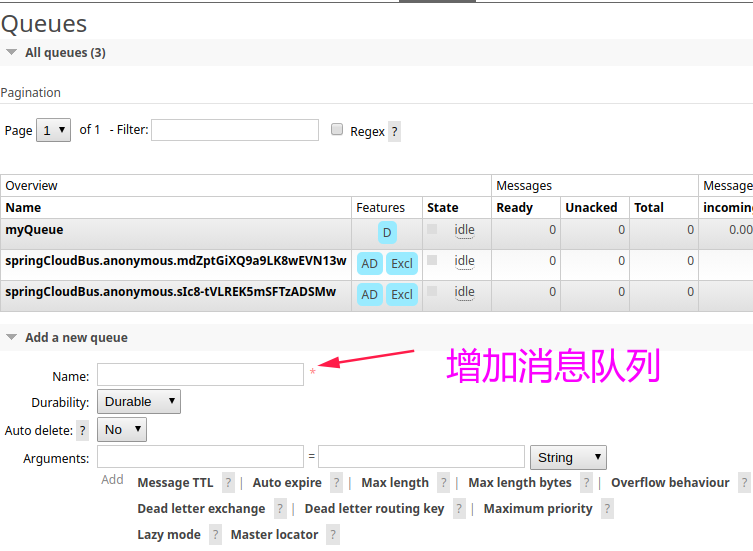
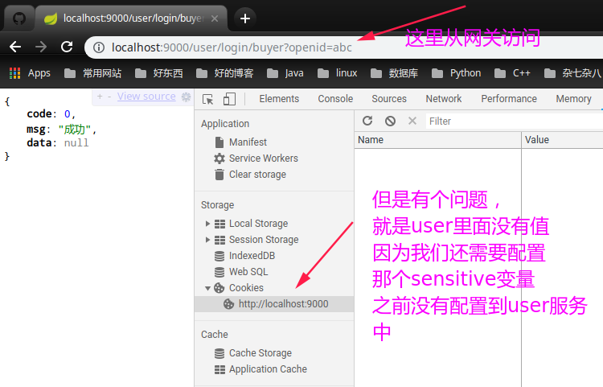

# 项目笔记


* [一、商品服务编码(product)](#一商品服务编码product)

  * [1、基础环境搭建](#1基础环境搭建)
  * [2、查询商品](2查询商品)
  * [3、构造数据](#3构造数据)
  * [4、商品部分测试和总结](#4商品部分测试和总结)
* [二、订单服务编码(order)](#二订单服务编码order)

  * [1、基础环境搭建](#1基础环境搭建)
  * [2、查询订单](#2查询订单)
  * [3、数据传输对象DTO](#3数据传输对象dto)
  * [4、数据校验和Controller编写](#4数据校验和controller编写)
  * [5、订单部分测试和总结](#5订单部分测试和总结)
* [三、应用通信(远程调用)](#三应用通信远程调用)

  * [1、完成从order服务到product服务查询商品的远程调用](#1完成从order服务到product服务查询商品的远程调用)
  * [2、扣库存(远程调用)](#2扣库存远程调用)
  * [3、整合接口，打通下单流程](#3整合接口打通下单流程)
* [四、改成多模块](#四改成多模块)

  * [1、改成多模块原因](#1改成多模块原因)
  * [2、改成多模块后的整体框架图](#2改成多模块后的整体框架图)
  * [3、product相关依赖和代码改变](#3product相关依赖和代码改变)
  * [4、order相关依赖和代码改变(有个注解记得加)](#4order相关依赖和代码改变有个注解记得加)
* [五、统一配置中心](#五统一配置中心)

  * [1、config-server介绍和配置](#1config-server介绍和配置)
  * [2、config-client(order)配置](#2config-clientorder配置)
  * [3、SpringCloud Bus自动刷新配置](#3springcloud-bus自动刷新配置)
* [六、异步和消息](#六异步和消息)

  * [1、RabbitMQ简单使用](#1rabbitmq简单使用)
  * [2、SpringCloud Stream的使用](#2springcloud-stream的使用)
  * [3、将消息队列应用到订单服务](#3将消息队列应用到订单服务)
  * [4、原始流程总结和异步扣库存分析](#4原始流程总结和异步扣库存分析)
* [七、服务网关Zuul](#七服务网关zuul)

  * [1、网关和Zuul介绍](#1网关和zuul介绍)
  * [2、基本配置服务网关](#2基本配置服务网关)
  * [3、限流](#3限流)
  * [4、实现买家卖家访问权限前的工作-添加user服务](#4实现买家卖家访问权限前的工作添加user服务)
  * [5、对买家和卖家进行权限校验](#5对买家和卖家进行权限校验)

## 一、商品服务编码(product)

总的业务逻辑:

* 1、查询所有在架的商品
* 2、获取类目type列表
* 3、查询类目
* 4、构造数据

### 1、基础环境搭建

在`product`模块中导入如下依赖，即spring-data和mysql。

```xml
<dependency>
    <groupId>org.springframework.boot</groupId>
    <artifactId>spring-boot-starter-data-jpa</artifactId>
</dependency>

<dependency>
    <groupId>mysql</groupId>
    <artifactId>mysql-connector-java</artifactId>
</dependency>
```

基本的配置文件`application.yml`:

```yaml
spring:
  application:
    name: product
  datasource:
    driver-class-name: com.mysql.jdbc.Driver
    username: root
    password: root
    url: jdbc:mysql://127.0.0.1:3306/zxorder?characterEncoding=utf-8&useSSL=false
  jpa:
    show-sql: true  # jpa方便调试
eureka:
  client:
    service-url:
      defaultZone: http://localhost:8761/eureka

```

两个实体类:

```java
@Data
@Entity
public class ProductCategory {

    @Id
    @GeneratedValue  // 自增
    private Integer categoryId;

    /** 类目名字. */
    private String categoryName;

    /** 类目编号. */
    private Integer categoryType;

    private Date createTime;

    private Date updateTime;
}

```

```java
@Data
//@Table(name = "T_proxxx")
@Entity // 标明和数据库表对应的实体
public class ProductInfo {

    @Id
    private String productId;

    /** 名字. */
    private String productName;

    /** 单价. */
    private BigDecimal productPrice;

    /** 库存. */
    private Integer productStock;

    /** 描述. */
    private String productDescription;

    /** 小图. */
    private String productIcon;

    /** 状态, 0正常1下架. */
    private Integer productStatus;

    /** 类目编号. */
    private Integer categoryType;

    private Date createTime;

    private Date updateTime;
}

```

### 2、查询商品

然后是查询类目和查询商品信息的`Repository`: (使用SpringData)

```java
public interface ProductCategoryRepository extends JpaRepository<ProductCategory, Integer> {

    List<ProductCategory> findByCategoryTypeIn(List<Integer> categoryTypeList);
}

```

```java
// 第一个参数是实体，第二个参数是主键的类型
public interface ProductInfoRepository extends JpaRepository<ProductInfo, String> {

    List<ProductInfo> findByProductStatus(Integer productStatus);
}

```

然后是查询在架商品的`Service`:

```java
public interface ProductService {

    /**
     * 查询所有在架 (up)商品
     */
    List<ProductInfo> findUpAll();
}
```

```java
@Service
public class ProductServiceImpl implements ProductService{

    // Dao层注入到Service层
    @Autowired
    private ProductInfoRepository productInfoRepository;

    @Override
    public List<ProductInfo> findUpAll() {
        return productInfoRepository.findByProductStatus(ProductStatusEnum.UP.getCode()); // 枚举, 在架的状态
    }
}

```

`ProductServiceImpl`中使用到的`Enum`:

```java
/**
 * 商品上下架状态
 */
@Getter
public enum ProductStatusEnum {

    UP(0, "在架"),
    DOWN(1, "下架"),
    ;

    private Integer code;
    private String msg;

    ProductStatusEnum(Integer code, String msg) {
        this.code = code;
        this.msg = msg;
    }
}
```

### 3、构造数据

下面是返回到前端的三个`ViewObject`:

```java
/**
 * http请求返回的最外层对象 , 第一层
 * @param <T>
 */
@Data
public class ResultVO<T> {
    /**
     * 错误码
     */
    private Integer code;

    /**
     * 提示信息
     */
    private String msg;

    private T data;
}

```

```java
// http请求返回的第二层对象 (就是类目)
@Data
public class ProductVO {

    @JsonProperty("name")  // 因为返回给前段又必须是 name, 所以加上这个注解
    private String categoryName;

    @JsonProperty("type")
    private Integer categoryType;

    @JsonProperty("foods")
    List<ProductInfoVO> productInfoVOList;
}
```

```java
// 第三层
@Data
public class ProductInfoVO {

    @JsonProperty("id")
    private String productId;

    @JsonProperty("name")
    private String productName;

    @JsonProperty("price")
    private BigDecimal productPrice;

    @JsonProperty("description")
    private String productDescription;

    @JsonProperty("icon")
    private String productIcon;
}

```

最后的查询分类的 Controller :

```java
@RestController
@RequestMapping("/product")
public class ProductController {

    @Autowired
    private CategoryService categoryService;

    @Autowired
    private ProductService productService;

    /**
     * 1、查询所有在架的商品
     * 2、获取类目type列表
     * 3、查询类目
     * 4、构造数据
     */
    @GetMapping("/list")
    public ResultVO<ProductVO> list(){
        // 1、查询所有在架的商品
        List<ProductInfo> productInfoList = productService.findUpAll();

        // 2、获取类目type列表 (所有商品的类目列表)
        List<Integer> categoryTypeList = productInfoList.stream()
                .map(ProductInfo::getCategoryType)
                .collect(Collectors.toList());

        // 3、从数据库查询类目 -- > 查询到所有类目
        List<ProductCategory> categoryList = categoryService.findByCategoryTypeIn(categoryTypeList);

        // 4、构造数据
        List<ProductVO> productVOList = new ArrayList<>(); //第二层的商品
        for(ProductCategory productCategory : categoryList){ // 遍历类目
            ProductVO productVo = new ProductVO();//外层的一个
            productVo.setCategoryName(productCategory.getCategoryName());
            productVo.setCategoryType(productCategory.getCategoryType());

            // 里面又是一个list -> 商品list
            List<ProductInfoVO> productInfoVoList = new ArrayList<>();
            for(ProductInfo productInfo : productInfoList){
                if(productInfo.getCategoryType().equals(productCategory.getCategoryType())) {

                    ProductInfoVO productInfoVO = new ProductInfoVO();
                    // source, target, 将source的属性拷贝的target中，省略了5个setter方法
                    BeanUtils.copyProperties(productInfo, productInfoVO);
                    productInfoVoList.add(productInfoVO);
                }
            }

            productVo.setProductInfoVOList(productInfoVoList);
            productVOList.add(productVo);
        }


        // 最外层的 --> 返回
        ResultVO resultVO = new ResultVO();
        resultVO.setData(productVOList);
        resultVO.setCode(0);
        resultVO.setMsg("成功");
        return resultVO;
    }
}

```

### 4、商品部分测试和总结

运行结果:


将上面的返回的`ViewObject`封装成工具类:

```java
/**
 * 返回 ViesObject的工具类
 */
public class ResultVOUtil {

    // 将返回做成了工具类
    public static ResultVO success(Object object){
        ResultVO resultVO = new ResultVO();
        resultVO.setData(object);
        resultVO.setCode(0);
        resultVO.setMsg("成功");
        return resultVO;
    }
}

```

然后代码改成:

```java
@GetMapping("/list")
public ResultVO<ProductVO> list(){
   
    //.... 省略中间

   // 最外层的 --> 返回
   return ResultVOUtil.success(productVOList); //包装成返回的工具类
}
```

商品服务代码就写到这里，上一张整体代码框架图:


<div align="center'> </div><br>


## 二、订单服务编码(order)

业务逻辑(这里用到了微服务)

* 1、参数校验；
* 2、查询商品信息 (需要调用远程服务 `Feign`；
* 3、计算总价；
* 4、扣库存(调用商品服务)；
* 5、订单入库；

注意两个表`order_detail`和`order_master`的关系。

`order_master`和`order_detail`是一对多的关系。


### 1、基础环境搭建

编码

基本`application.yml`配置:

也是先写实体类:

```java
@Data
@Entity
public class OrderDetail {

    @Id
    private String detailId;

    /** 订单id. */
    private String orderId;

    /** 商品id. */
    private String productId;

    /** 商品名称. */
    private String productName;

    /** 商品单价. */
    private BigDecimal productPrice;

    /** 商品数量. */
    private Integer productQuantity;

    /** 商品小图. */
    private String productIcon;
}
```

```java
@Data
@Entity
public class OrderMaster {

    /** 订单id. */
    @Id
    private String orderId;

    /** 买家名字. */
    private String buyerName;

    /** 买家手机号. */
    private String buyerPhone;

    /** 买家地址. */
    private String buyerAddress;

    /** 买家微信Openid. */
    private String buyerOpenid;

    /** 订单总金额. */
    private BigDecimal orderAmount;

    /** 订单状态, 默认为0新下单. */
    private Integer orderStatus;

    /** 支付状态, 默认为0未支付. */
    private Integer payStatus;

    /** 创建时间. */
    private Date createTime;

    /** 更新时间. */
    private Date updateTime;
}
```

### 2、查询订单

然后是 `dao`层:

```java
public interface OrderDetailRepository extends JpaRepository<OrderDetail, String> {

	List<OrderDetail> findByOrderId(String orderId);
}
```

```java
// 里面方法不需要写，直接调用已有方法即可
public interface OrderMasterRepository extends JpaRepository<OrderMaster, String> {
}
```

测试`OrderMasterRepository`:


测试二:


这里用到的几个枚举类:

```java
/**
 * 订单状态
 */
@Getter
public enum OrderStatusEnum {
    NEW(0, "新订单"),
    FINISHED(1, "完结"),
    CANCEL(2, "取消"),
    ;
    private Integer code;

    private String message;

    OrderStatusEnum(Integer code, String message) {
        this.code = code;
        this.message = message;
    }
}
```

```java
/**
 * 支付状态
 */
@Getter
public enum PayStatusEnum {
    WAIT(0, "等待支付"),
    SUCCESS(1, "支付成功"),
    ;
    private Integer code;

    private String message;

    PayStatusEnum(Integer code, String message) {
        this.code = code;
        this.message = message;
    }
}
```

```java
/**
 * 返回结果的状态 
 */
@Getter
public enum ResultEnum {
    PARAM_ERROR(1, "参数错误"),
    CART_EMPTY(2, "购物车为空"),
    ORDER_NOT_EXIST(3, "订单不存在"),
    ORDER_STATUS_ERROR(4, "订单状态错误"),
    ORDER_DETAIL_NOT_EXIST(5, "订单详情不存在"),

    ;

    private Integer code;

    private String message;

    ResultEnum(Integer code, String message) {
        this.code = code;
        this.message = message;
    }
}
```

### 3、数据传输对象DTO

然后就是写Service,但是这里由于需要`OrderMaster`和`OrderDetail`，但是又不匹配，所以我们先写一个`DTO`。

注意到`OrderDTO`最后一行有一个`OrderDetail`的`List`，相当于`OrderMaster`和`OrderDetail`一对多，然后`OrderMaster`里面就有多个`OrderDetail`。

```java
@Data
public class OrderDTO {

    /** 订单id. */
    private String orderId;

    /** 买家名字. */
    private String buyerName;

    /** 买家手机号. */
    private String buyerPhone;

    /** 买家地址. */
    private String buyerAddress;

    /** 买家微信Openid. */
    private String buyerOpenid;

    /** 订单总金额. */
    private BigDecimal orderAmount;

    /** 订单状态, 默认为0新下单. */
    private Integer orderStatus;

    /** 支付状态, 默认为0未支付. */
    private Integer payStatus;

    // 这个就是转换的, OrderMaster中有多个OrderDetail
    private List<OrderDetail> orderDetailList;
}
```

> 数据传输对象（DTO)(Data Transfer Object)，是一种设计模式之间传输数据的软件应用系统。数据传输目标往往是[数据访问对象](https://baike.baidu.com/item/%E6%95%B0%E6%8D%AE%E8%AE%BF%E9%97%AE%E5%AF%B9%E8%B1%A1/3351868)从数据库中检索数据。数据传输对象与数据交互对象或数据访问对象之间的差异是一个以不具有任何行为除了存储和检索的数据（访问和存取器）。

然后就是`Service`和`ServiceImpl`:

```javascript
public interface OrderService {

    // 这个就是创建订单
    OrderDTO create(OrderDTO orderDTO);

}
```

注意这个Service还不完善:

```java
@Service
public class OrderServiceImpl implements OrderService {

    // 这里需要注入两个 Repository

    @Autowired
    private OrderDetailRepository orderDetailRepository;
    @Autowired
    private OrderMasterRepository orderMasterRepository;

    @Override
    public OrderDTO create(OrderDTO orderDTO) {

        /**
         *
         TODO 2、查询商品信息 (需要调用远程服务 Feign)；
         TODO 3、计算总价；
         TODO 4、扣库存(调用商品服务)；
         5、订单入库；  (这个可以做)
         */

        // 5、订单入库 (OrderMaster)
        OrderMaster orderMaster = new OrderMaster();
        orderDTO.setOrderId(KeyUtil.generateUniqueKey()); // 生成唯一的订单逐渐(订单号)
        BeanUtils.copyProperties(orderDTO, orderMaster); // 将orderDTO拷贝到orderMaster
        orderMaster.setOrderAmount(new BigDecimal(5));
        orderMaster.setOrderStatus(OrderStatusEnum.NEW.getCode());
        orderMaster.setPayStatus(PayStatusEnum.WAIT.getCode());

        orderMasterRepository.save(orderMaster);
        return orderDTO;
    }
}
```

这里用到了一个生成`key`(主键的工具):

```java
public class KeyUtil {

    /**
     * 生成唯一的主键
     * 格式: 时间戳 + 随机数
     */
    public static synchronized String generateUniqueKey(){
        // 这里只是模拟唯一，不能降低到 100%的唯一
        Random rnd = new Random();
        Integer num = rnd.nextInt(900000) + 100000;
        return System.currentTimeMillis() + String.valueOf(num); // 生成一个随机的串
    }
}
```

### 4、数据校验和Controller编写

然后就是`Controller`的编写:

因为我们需要进行参数校验，所以写了一个从前端传过来数据的类(在`form`包下)：

这里进行了数据校验:

```java
/**
 * 前端API传递过来的参数
 */
@Data
public class OrderForm {

    // 传递过来的参数, 注意这里有表单验证
    /**
     * 买家姓名
     */
    @NotEmpty(message = "姓名必填")
    private String name;

    /**
     * 买家手机号
     */
    @NotEmpty(message = "手机号必填")
    private String phone;

    /**
     * 买家地址
     */
    @NotEmpty(message = "地址必填")
    private String address;

    /**
     * 买家微信openid
     */
    @NotEmpty(message = "openid必填")
    private String openid;

    /**
     * 购物车, 这里本来传递给我的是一个String ，但是也是一个字符串 ，先拿到一个字符串，然后再做处理
     */
    @NotEmpty(message = "购物车不能为空")
    private String items;
}
```

如果校验有误，我们抛出一个`OrderException`:

```java
/**
 * 订单异常
 */
public class OrderException extends RuntimeException{

    private Integer code; //异常类型

    public OrderException(Integer code, String message){
        super(message);
        this.code = code;
    }

    public OrderException(ResultEnum resultEnum){
        super(resultEnum.getMessage());
        this.code = resultEnum.getCode();
    }
}
```

>

在这个过程中，我们要将`OrderForm`转换成`OrderDTO`，我们为此写了一个`Converter`:

`orderForm -> orderDTO`  将ordrForm转换成orderDTO，这样就可以调用那个service了

```java
@Slf4j
public class OrderForm2OrderDTOConverter {

    public static OrderDTO convert(OrderForm orderForm){
        Gson gson = new Gson();
        OrderDTO orderDTO = new OrderDTO();
        orderDTO.setBuyerName(orderForm.getName());
        orderDTO.setBuyerPhone(orderForm.getPhone());
        orderDTO.setBuyerAddress(orderForm.getAddress());
        orderDTO.setBuyerOpenid(orderForm.getOpenid());

        List<OrderDetail> orderDetailList = new ArrayList<>(); //保存的
        try {
            orderDetailList = gson.fromJson(orderForm.getItems(),
                    new TypeToken<List<OrderDetail>>() {
                    }.getType());
        } catch (Exception e) {
            log.error("【json转换】错误, string={}", orderForm.getItems());
            throw new OrderException(ResultEnum.PARAM_ERROR);  //参数错误
        }

        orderDTO.setOrderDetailList(orderDetailList);
        return orderDTO;
    }
}

```

然后我们的Controller就可以调用`Service`了，Controller代码如下:

```java

@RestController
@RequestMapping("/order")
@Slf4j
public class OrderController {

    @Autowired
    private OrderService orderService;

    /**
     * 下单步骤
       1、参数校验；
       2、查询商品信息 (需要调用远程服务 Feign；
       3、计算总价；
       4、扣库存(调用商品服务)；
       5、订单入库；
     */

    // 这里参数很多，所以构造一个对象
    // 校验，这里校验不清楚的可以看这篇博客: https://www.cnblogs.com/cjsblog/p/8946768.html
    @PostMapping("/create")
    public ResultVO<Map<String, String>> create(@Valid OrderForm orderForm,
                                                BindingResult bindingResult){

        // 参数绑定有误
        if(bindingResult.hasErrors()) {
            log.error("【创建订单】参数不正确, orderForm={}", orderForm);
            throw new OrderException(ResultEnum.PARAM_ERROR.getCode(),
                    bindingResult.getFieldError().getDefaultMessage()); // 获取到 @NotEmpty(message = "姓名必填")的错误信息
        }

        // orderForm -> orderDTO  将ordrForm转换成orderDTO，这样就可以调用那个service了
        // 调用转换器
        OrderDTO orderDTO = OrderForm2OrderDTOConverter.convert(orderForm);

        //还需要再判断一次是不是为空
        if(CollectionUtils.isEmpty(orderDTO.getOrderDetailList())){
            log.error("【创建订单】购物车为空!");
            throw new OrderException(ResultEnum.CART_EMPTY);
        }

        // 创建订单
        OrderDTO result = orderService.create(orderDTO);

        // 返回的结果
        HashMap<String, String> map = new HashMap<>();
        map.put("orderId", result.getOrderId());

        return ResultVOUtil.success(map);
    }
}

```

这个过程也用到了和`product`微服务一样的两个返回结果处理类:

```java
// 返回给前端的结果
@Data
public class ResultVO<T> {

    private Integer code;

    private String msg;

    private T data;
}
```

```java
public class ResultVOUtil {

    public static ResultVO success(Object object) {
        ResultVO resultVO = new ResultVO();
        resultVO.setCode(0);
        resultVO.setMsg("成功");
        resultVO.setData(object);
        return resultVO;
    }
}
```

以及一个枚举类:

```java
/**
 * 返回结果的状态
 */
@Getter
public enum ResultEnum {
    PARAM_ERROR(1, "参数错误"),
    CART_EMPTY(2, "购物车为空"),
    ORDER_NOT_EXIST(3, "订单不存在"),
    ORDER_STATUS_ERROR(4, "订单状态错误"),
    ORDER_DETAIL_NOT_EXIST(5, "订单详情不存在"),

    ;

    private Integer code;

    private String message;

    ResultEnum(Integer code, String message) {
        this.code = code;
        this.message = message;
    }
}
```

### 5、订单部分测试和总结

在`8081`端口启动(之前在`8080`已经启动了`product`微服务):

<div align="center"></div><br>

也看一下这一部分(`order`微服务)的代码框架:

<div align="center"></div><br>

总结: 服务拆分的方法论:

* 每个微服务都有单独的数据存储；
* 依据服务特点选择不同结构的数据库类型。(MongoDB、MYSQL、ES)
* 难点在确定边界；
* 针对边界设计API；
* 依据边界权衡数据冗余；

## 三、应用通信(远程调用)

有两种通信方式: HTTP和RPC。

HTTP的典型代表: `SpringCloud`。

RPC的典型代表： `Dubbo`。

下面介绍在`SpringCloud`中服务间的两种调用方式: ① RestTemplate，② Feign。

`RestTemplate`和`Feign`之前在`LYDemo`中写过了，这里使用`Feign`进行远程调用。

### 1、完成从order服务到product服务查询商品的远程调用

下面将我们要在订单`order`服务中调用`product`服务的过程利用`Feign`实现。

**注意这个过程**的调用位置:


这里`order`服务需要调用商品服务`product`来查询商品信息: 传过去`productId`:

于是我们在`product`服务的`Controller`中添加一个专门查询商品，且是专门给订单服务`order`用的方法:

**先看`product`这边的改变**: 

先写`dao`层的方法:

注意只看下面新增的方法：

```java
// 第一个参数是实体，第二个参数是主键的类型
public interface ProductInfoRepository extends JpaRepository<ProductInfo, String> {

    List<ProductInfo> findByProductStatus(Integer productStatus);


    // 后来为订单服务重新写的
    List<ProductInfo> findByProductIdIn(List<String> productIdList);
}
```

然后service层也加了对应的方法 (删除了原来写好的方法):

```java
@Service
public class ProductServiceImpl implements ProductService{

    // Dao层注入到Service层
    @Autowired
    private ProductInfoRepository productInfoRepository;

    // 后来加的
    @Override
    public List<ProductInfo> findList(List<String> productIdList) {
        return productInfoRepository.findByProductIdIn(productIdList);
    }
}
```

最后在`product`服务的`Controller`中增加的方法:

```java
/**
* 获取商品列表(专门给订单服务用的)
* @param productIdList
* @return
*/
@GetMapping("listForOrder")
public List<ProductInfo> listForOrder(List<String>productIdList){
    return productService.findList(productIdList);
}
```

中间对`dap`层的测试: 测试查询`ProductInfoRepository`中新写的方法:`findByProductIdIn`


下面在`order`服务这边调用那边`product`服务的服务。

只需要利用`Feign`来远程调用即可。

```java
// Feign的配置  底层使用的是动态代理 , 远程调用
@FeignClient(value = "product")
public interface ProductClient {

//    @GetMapping("/product/listForOrder") // 切记切记，不能用GetMapping，因为RequestBody不能用GetMapping
    @PostMapping("/product/listForOrder")  // 注意不要忘记product前缀
    List<ProductInfo> listForOrder(@RequestBody List<String>productIdList); // 用RequestParam就可以用GetMapping
}
```

>  注意加`/product`前缀，以及由于使用了`@RequestBody`，所以只能使用`PostMapping`。																																																																																		

注意这边(`order`)要使用`ProductInfo`，所以在`order`服务这边也要拷贝一份`ProductInfo`。

### 2、扣库存(远程调用)

由于扣库存需要传入一个`list`，且里面有`id`和`count`（商品ID和数量），所以我们又定义了一个`DTO`如下:

```java
// 订单服务 调用商品服务 扣库存的 传入的 json的一个数据转换 dto
@Data
public class CartDTO {

    /**
     * 商品ID
     */
    private String productId;

    /**
     * 商品数量
     */
    private Integer productQuantity;


    public CartDTO() {
    }

    public CartDTO(String productId, Integer productQuantity) {
        this.productId = productId;
        this.productQuantity = productQuantity;
    }
}
```

先在`product`服务的`ProduceService`中操作：

```java
@Service
public class ProductServiceImpl implements ProductService{
    // 后来加的， 扣库存的
    @Override
    @Transactional // 由于是list，进行事务处理
    public void decreaseStock(List<CartDTO> cartDTOList) {

        for(CartDTO cartDTO : cartDTOList){
            Optional<ProductInfo> productInfoOptional = productInfoRepository.findById(cartDTO.getProductId());
            //判断商品是否存在
            if(!productInfoOptional.isPresent()){ //如果商品不存在 ,抛出一个异常
                throw new ProductException(ResultEnum.PRODUCT_NOT_EXIST);
            }
            // 如果商品存在，还需要判断一下数量
            ProductInfo productInfo = productInfoOptional.get();
            Integer result = productInfo.getProductStock() - cartDTO.getProductQuantity();
            if(result < 0) { //库存不够
                throw new ProductException(ResultEnum.PRODUCT_STOCK_ERROR);
            }

            productInfo.setProductStock(result);
            /**
             * 网上看到一个问题, 但我这里应该没有问题.
             * JpaRepository的save(product)方法做更新操作,更新商品的库存和价格，所以入参的product只
              设置了商品的库存和价格，结果调用完save方法后，除了库存和价格的数据变了，其他字段全部被更新成了null
             */
            productInfoRepository.save(productInfo); // 保存更新
        }
    }
}
```

注意在`ProductServiceImple`的`decreaseStock`中，我还进行了事务处理(`@Transactional`)。

这里面用到一个`ProductException`和一个枚举:

```java
// 库存不够。。。等的异常

import com.zxin.product.enums.ResultEnum;

public class ProductException extends RuntimeException {

    private Integer code;

    public ProductException(Integer code, String message){
        super(message);
        this.code = code;

    }

    public ProductException(ResultEnum resultEnum){
        super(resultEnum.getMessage());
        this.code = resultEnum.getCode();
    }
}
```

```java
@Getter
public enum  ResultEnum {

    PRODUCT_NOT_EXIST(1, "商品不存在"),
    PRODUCT_STOCK_ERROR(2, "库存有误"),
    ;

    private Integer code;

    private String message;

    ResultEnum(Integer code, String message) {
        this.code = code;
        this.message = message;
    }
}
```

最后在`ProductController`中加上我们给`order`调用的代码:

```java
@RestController
@RequestMapping("/product")
public class ProductController {

    @Autowired
    private CategoryService categoryService;

    @Autowired
    private ProductService productService;
    
	// 扣库存(供 order 调用)
    @PostMapping("/decreaseStock")
    public void decreaseStock(@RequestBody List<CartDTO> cartDTOList){
        productService.decreaseStock(cartDTOList);
    }
}
```

然后就是在`order`这边扣库存调用的代码了，也是用了`Feign`: (下面那个方法)

```java
// Feign的配置  底层使用的是动态代理 , 远程调用
@FeignClient(value = "product")
public interface ProductClient {

//    @GetMapping("/product/listForOrder") // 切记切记，不能用GetMapping，因为RequestBody不能用GetMapping
    @PostMapping("/product/listForOrder")  // 注意不要忘记product前缀
    List<ProductInfo> listForOrder(@RequestBody List<String>productIdList); // 用RequestParam就可以用GetMapping


    @PostMapping("/product/decreaseStock")
    void decreaseStock(@RequestBody List<CartDTO> cartDTOList);
}
```

相应的在`order`这边也要有一个`CartDTO`。

### 3、整合接口，打通下单流程

最后我们在`order`的`OrderServiceImpl`这里完成所有的流程，包括：

* 查询商品信息；
* 计算总价；
* 存入库存；
* 订单入库

代码如下

```java
@Service
public class OrderServiceImpl implements OrderService {

    // 这里需要注入两个 Repository

    @Autowired
    private OrderDetailRepository orderDetailRepository;
    @Autowired
    private OrderMasterRepository orderMasterRepository;

    @Autowired
    private ProductClient productClient; // 需要远程调用

    @Override
    public OrderDTO create(OrderDTO orderDTO) {

        /**
         *
         2、查询商品信息 (需要调用远程服务 Feign)；
         3、计算总价；
         4、扣库存(调用商品服务)；
         5、订单入库；  (这个可以做)
         */
        String orderId = KeyUtil.generateUniqueKey();

        //  2、查询商品信息 (需要调用远程服务 Feign)；
        List<String> productIdList = orderDTO.getOrderDetailList().stream()
                .map(OrderDetail::getProductId)
                .collect(Collectors.toList());
        List<ProductInfo> productInfoList = productClient.listForOrder(productIdList);//需要传递ProductId <List>

        // 3、计算总价；
        BigDecimal orderAmount = new BigDecimal(BigInteger.ZERO);
        for(OrderDetail orderDetail : orderDTO.getOrderDetailList()){

            // 和查询到的商品的单价
            for(ProductInfo productInfo : productInfoList){
                // 判断相等才计算
                if(productInfo.getProductId().equals(orderDetail.getProductId())){
                    // 单价 productInfo.getProductPrice()
                    // 数量 orderDetail.getProductQuantity(
                    orderAmount = productInfo.getProductPrice()
                            .multiply(new BigDecimal(orderDetail.getProductQuantity()))
                            .add(orderAmount);

                    //给订单详情赋值
                    BeanUtils.copyProperties(productInfo, orderDetail); //这种拷贝要注意值为null也会拷贝
                    orderDetail.setOrderId(orderId);
                    orderDetail.setDetailId(KeyUtil.generateUniqueKey()); // 每个Detail的Id

                    // 订单详情入库
                    orderDetailRepository.save(orderDetail);
                }
            }
        }

        // 4、扣库存(调用商品服务)；
        List<CartDTO> cartDTOList = orderDTO.getOrderDetailList().stream()
                .map(e -> new CartDTO(e.getProductId(), e.getProductQuantity()))
                .collect(Collectors.toList());
        productClient.decreaseStock(cartDTOList); //订单主库入库了

        // 5、订单入库 (OrderMaster)
        OrderMaster orderMaster = new OrderMaster();
        orderDTO.setOrderId(orderId); // 生成唯一的订单逐渐(订单号)
        BeanUtils.copyProperties(orderDTO, orderMaster); // 将orderDTO拷贝到orderMaster
        orderMaster.setOrderAmount(orderAmount); // 设置订单总金额
        orderMaster.setOrderStatus(OrderStatusEnum.NEW.getCode());
        orderMaster.setPayStatus(PayStatusEnum.WAIT.getCode());

        orderMasterRepository.save(orderMaster); //存在主仓库
        return orderDTO;
    }
}

```

测试:

更改前:


然后使用postman对`order` (8081端口)发送`/order/create`请求:


最后数据库的更改:


## 四、改成多模块

### 1、改成多模块原因

上面虽然完成了商品模块和订单模块的代码，但是代码存在如下的问题：

* 我们的实体类`ProductInfo`暴露给了`order`，实际中这样是不行的；
* 我们在`order`服务中写了重复写了一份`ProductInfo`的代码，这也是冗余代码；
* 我们的远程调用是自己在`order`这边写了一个`ProductClient`，这样不合理，因为两个服务要解耦，就不应该在`order`这边定义`Product`的服务，也就是不能将对方的服务定义到自己的服务中；应该将`ProductClient`定义到商品服务中。


### 2、改成多模块后的整体框架图

先给出我们重构后的整体依赖图:


### 3、product相关依赖和代码改变

首先`product`的总pom文件改成`pom`类型的，以及定义相关的版本和子模块。(注意打包方式改成`pom`)

```xml
<?xml version="1.0" encoding="UTF-8"?>
<project xmlns="http://maven.apache.org/POM/4.0.0" xmlns:xsi="http://www.w3.org/2001/XMLSchema-instance"
         xsi:schemaLocation="http://maven.apache.org/POM/4.0.0 http://maven.apache.org/xsd/maven-4.0.0.xsd">
    <modelVersion>4.0.0</modelVersion>
    <groupId>com.zxin</groupId>
    <artifactId>product</artifactId>
    <version>0.0.1-SNAPSHOT</version>
    <modules>
        <module>common</module>
        <module>server</module>
        <module>client</module>
    </modules>

    <name>product</name>
    <packaging>pom</packaging> <!--注意打包方式-->

    <description>Demo project for Spring Boot</description>

    <parent>
        <groupId>org.springframework.boot</groupId>
        <artifactId>spring-boot-starter-parent</artifactId>
        <version>2.1.3.RELEASE</version>
        <relativePath/> <!-- lookup parent from repository -->
    </parent>

    <properties>
        <project.build.sourceEncoding>UTF-8</project.build.sourceEncoding>
        <project.reporting.outputEncoding>UTF-8</project.reporting.outputEncoding>
        <java.version>1.8</java.version>
        <spring-cloud.version>Greenwich.SR1</spring-cloud.version>

        <product-common.version>0.0.1-SNAPSHOT</product-common.version>

    </properties>

    <dependencyManagement>
        <dependencies>
            <dependency>
                <groupId>org.springframework.cloud</groupId>
                <artifactId>spring-cloud-dependencies</artifactId>
                <version>${spring-cloud.version}</version>
                <type>pom</type>
                <scope>import</scope>
            </dependency>

            <dependency>
                <groupId>com.zxin</groupId>
                <artifactId>product-common</artifactId>
                <version>${product-common.version}</version>
            </dependency>
        </dependencies>
    </dependencyManagement>
</project>

```

然后是`product-server`的`pom`中要改成`parent`是`product`:

```xml
<parent>
    <artifactId>product</artifactId>
    <groupId>com.zxin</groupId>
    <version>0.0.1-SNAPSHOT</version>
</parent>
<modelVersion>4.0.0</modelVersion>
<artifactId>product-server</artifactId>

<description>Demo project for Spring Boot</description>

```

其他的`pom`文件更改也是类似。

然后就是我们在`product-common`中增加了两个给外界暴露的类:

这个类和`CartDTO`是一样的；

```java
@Data
public class DecreaseStockInput {

    private String productId;

    private Integer productQuantity;

    public DecreaseStockInput() {
    }

    public DecreaseStockInput(String productId, Integer productQuantity) {
        this.productId = productId;
        this.productQuantity = productQuantity;
    }
}
```

下面这个类和`ProductInfo`一样的:

```java
@Data
public class ProductInfoOutput {

    private String productId;

    /** 名字. */
    private String productName;

    /** 单价. */
    private BigDecimal productPrice;

    /** 库存. */
    private Integer productStock;

    /** 描述. */
    private String productDescription;

    /** 小图. */
    private String productIcon;

    /** 状态, 0正常1下架. */
    private Integer productStatus;

    /** 类目编号. */
    private Integer categoryType;
}
```

然后注意需要更改的类:

* `ProductService`；
* `ProductServiceImpl`；
* `Controller`中暴露给`order`的两个方法；

```java
public interface ProductService {

    /**
     * 查询所有在架 (up)商品
     */
    List<ProductInfo> findUpAll();


    /**
     * 查询商品列表
     * @param productIdList
     * @return
     */
    List<ProductInfoOutput> findList(List<String> productIdList);

    /**
     * 扣库存
     * @param decreaseStockInputList
     */
    void decreaseStock(List<DecreaseStockInput> decreaseStockInputList);
}

```

```java
@Service
public class ProductServiceImpl implements ProductService{

    // Dao层注入到Service层
    @Autowired
    private ProductInfoRepository productInfoRepository;

    @Override
    public List<ProductInfo> findUpAll() {
        return productInfoRepository.findByProductStatus(ProductStatusEnum.UP.getCode()); // 枚举, 在架的状态
    }

    // 后来加的, 再后来改成了多模块
    @Override
    public List<ProductInfoOutput> findList(List<String> productIdList) {
        // 改写之前的代码
//        return productInfoRepository.findByProductIdIn(productIdList);
        // 多模块之后的, 将List<ProductInfo>转换成 ProductInfoOutput
        return productInfoRepository.findByProductIdIn(productIdList).stream()
                .map(e -> {
                    ProductInfoOutput output = new ProductInfoOutput();
                    BeanUtils.copyProperties(e, output);
                    return output;
                })
                .collect(Collectors.toList());
    }

    // 后来加的， 扣库存的
    @Override
    public void decreaseStock(List<DecreaseStockInput> decreaseStockInputList) {

        // 改写之前代码
//
//        for(CartDTO cartDTO : cartDTOList){
//            Optional<ProductInfo> productInfoOptional = productInfoRepository.findById(cartDTO.getProductId());
//            //判断商品是否存在
//            if(!productInfoOptional.isPresent()){ //如果商品不存在 ,抛出一个异常
//                throw new ProductException(ResultEnum.PRODUCT_NOT_EXIST);
//            }
//            // 如果商品存在，还需要判断一下数量
//            ProductInfo productInfo = productInfoOptional.get();
//            Integer result = productInfo.getProductStock() - cartDTO.getProductQuantity();
//            if(result < 0) { //库存不够
//                throw new ProductException(ResultEnum.PRODUCT_STOCK_ERROR);
//            }
//
//            productInfo.setProductStock(result);
//            /**
//             * 网上看到一个问题, 但我这里应该没有问题.
//             * JpaRepository的save(product)方法做更新操作,更新商品的库存和价格，所以入参的product只
//              设置了商品的库存和价格，结果调用完save方法后，除了库存和价格的数据变了，其他字段全部被更新成了null
//             */
//            productInfoRepository.save(productInfo); // 保存更新
//        }

        decreaseStockProcess(decreaseStockInputList);
    }


    @Transactional
    public List<ProductInfo> decreaseStockProcess(List<DecreaseStockInput> decreaseStockInputList) {
        List<ProductInfo> productInfoList = new ArrayList<>();

        for (DecreaseStockInput decreaseStockInput: decreaseStockInputList) {
            Optional<ProductInfo> productInfoOptional = productInfoRepository.findById(decreaseStockInput.getProductId());
            //判断商品是否存在
            if (!productInfoOptional.isPresent()){
                throw new ProductException(ResultEnum.PRODUCT_NOT_EXIST);
            }

            ProductInfo productInfo = productInfoOptional.get();
            //库存是否足够
            Integer result = productInfo.getProductStock() - decreaseStockInput.getProductQuantity();
            if (result < 0) {
                throw new ProductException(ResultEnum.PRODUCT_STOCK_ERROR);
            }

            productInfo.setProductStock(result);
            productInfoRepository.save(productInfo);

            productInfoList.add(productInfo);
        }
        return productInfoList;
    }
}

```

```java
    /**
     * 获取商品列表(专门给订单服务用的)
     *
     * 注意这里的@RequestBody的用法 参考: https://blog.csdn.net/justry_deng/article/details/80972817
     * @param productIdList
     * @return
     */
//    @GetMapping("/listForOrder") // 切记不要用 GetMapping
    @PostMapping("/listForOrder")
    public List<ProductInfoOutput> listForOrder(@RequestBody List<String>productIdList){ // 注意这里的@RequestBody的用法
        return productService.findList(productIdList);
    }

    // 扣库存(供 order 调用)
    @PostMapping("/decreaseStock")
    public void decreaseStock(@RequestBody List<DecreaseStockInput> decreaseStockInputList) {
        productService.decreaseStock(decreaseStockInputList);
    }
```

最后，我们还要在`product-client`中添加一个`FeignClient`供`order`远程调用:

```java
@FeignClient(name = "product", fallback = ProductClient.ProductClientFallback.class)
public interface ProductClient {

    @PostMapping("/product/listForOrder")
    List<ProductInfoOutput> listForOrder(@RequestBody List<String> productIdList);

    @PostMapping("/product/decreaseStock")
    void decreaseStock(@RequestBody List<DecreaseStockInput> decreaseStockInputList);

    @Component
    static class ProductClientFallback implements ProductClient {

        @Override
        public List<ProductInfoOutput> listForOrder(List<String> productIdList) {
            return null;
        }

        @Override
        public void decreaseStock(List<DecreaseStockInput> decreaseStockInputList) {

        }
    }
}
```

### 4、order相关依赖和代码改变(有个注解记得加)

注意我们`order`服务这边，`order-client`和`client-common`基本没有使用。

然后看一下`order`这边更改。

首先也是`pom`文件改变:

```xml
<?xml version="1.0" encoding="UTF-8"?>
<project xmlns="http://maven.apache.org/POM/4.0.0" xmlns:xsi="http://www.w3.org/2001/XMLSchema-instance"
	xsi:schemaLocation="http://maven.apache.org/POM/4.0.0 http://maven.apache.org/xsd/maven-4.0.0.xsd">
	<modelVersion>4.0.0</modelVersion>

	<groupId>com.zxin</groupId>
	<artifactId>order</artifactId>
	<version>0.0.1-SNAPSHOT</version>
	<modules>
		<module>client</module>
		<module>common</module>
		<module>server</module>
	</modules>
	<packaging>pom</packaging>

	<name>order</name>
	<description>Demo project for Spring Boot</description>

	<parent>
		<groupId>org.springframework.boot</groupId>
		<artifactId>spring-boot-starter-parent</artifactId>
		<version>2.1.3.RELEASE</version>
		<relativePath/> <!-- lookup parent from repository -->
	</parent>

	<properties>
		<java.version>1.8</java.version>
		<spring-cloud.version>Greenwich.SR1</spring-cloud.version>

		<product-client.version>0.0.1-SNAPSHOT</product-client.version>
		<product-common.version>0.0.1-SNAPSHOT</product-common.version>
	</properties>

	<dependencyManagement>
		<dependencies>
			<dependency>
				<groupId>org.springframework.cloud</groupId>
				<artifactId>spring-cloud-dependencies</artifactId>
				<version>${spring-cloud.version}</version>
				<type>pom</type>
				<scope>import</scope>
			</dependency>

			<!--将版本控制好-->
			<dependency>
				<groupId>com.zxin</groupId>
				<artifactId>product-client</artifactId>
				<version>${product-client.version}</version>
			</dependency>
			<dependency>
				<groupId>com.zxin</groupId>
				<artifactId>product-common</artifactId>
				<version>${product-common.version}</version>
			</dependency>
		</dependencies>
	</dependencyManagement>
</project>

```

我们在`order-server`只需要改变`OrderServiceImpl`:

```java
@Service
public class OrderServiceImpl implements OrderService {

    // 这里需要注入两个 Repository

    @Autowired
    private OrderDetailRepository orderDetailRepository;
    @Autowired
    private OrderMasterRepository orderMasterRepository;

    @Autowired
    private ProductClient productClient; // 需要远程调用 ，注意这个是product中的ProductClient, 不是自己服务的

    @Override
    public OrderDTO create(OrderDTO orderDTO) {

        /**
         *
         2、查询商品信息 (需要调用远程服务 Feign)；
         3、计算总价；
         4、扣库存(调用商品服务)；
         5、订单入库；  (这个可以做)
         */
        String orderId = KeyUtil.generateUniqueKey();

        //  2、查询商品信息 (需要调用远程服务 Feign)；
        List<String> productIdList = orderDTO.getOrderDetailList().stream()
                .map(OrderDetail::getProductId)
                .collect(Collectors.toList());

//        List<ProductInfo> productInfoList = productClient.listForOrder(productIdList);//需要传递ProductId <List>
        // 改成多模块之后，上面那句变成这句
        List<ProductInfoOutput> productInfoList = productClient.listForOrder(productIdList);


        // 3、计算总价；
        BigDecimal orderAmount = new BigDecimal(BigInteger.ZERO);
        for(OrderDetail orderDetail : orderDTO.getOrderDetailList()){

            // 和查询到的商品的单价
//            for(ProductInfo productInfo : productInfoList){
                for(ProductInfoOutput productInfo : productInfoList){ // 改成多模块
                    // 判断相等才计算
                if(productInfo.getProductId().equals(orderDetail.getProductId())){
                    // 单价 productInfo.getProductPrice()
                    // 数量 orderDetail.getProductQuantity(
                    orderAmount = productInfo.getProductPrice()
                            .multiply(new BigDecimal(orderDetail.getProductQuantity()))
                            .add(orderAmount);

                    //给订单详情赋值
                    BeanUtils.copyProperties(productInfo, orderDetail); //这种拷贝要注意值为null也会拷贝
                    orderDetail.setOrderId(orderId);
                    orderDetail.setDetailId(KeyUtil.generateUniqueKey()); // 每个Detail的Id

                    // 订单详情入库
                    orderDetailRepository.save(orderDetail);
                }
            }
        }

        // 4、扣库存(调用商品服务)；
//        List<CartDTO> cartDTOList = orderDTO.getOrderDetailList().stream()
//                .map(e -> new CartDTO(e.getProductId(), e.getProductQuantity()))
//                .collect(Collectors.toList());
//        productClient.decreaseStock(cartDTOList); //订单主库入库了
        // 上面是多模块之前，　下面是多模块之后
        List<DecreaseStockInput> decreaseStockInputList = orderDTO.getOrderDetailList().stream()
                .map(e -> new DecreaseStockInput(e.getProductId(), e.getProductQuantity()))
                .collect(Collectors.toList());
        productClient.decreaseStock(decreaseStockInputList);


        // 5、订单入库 (OrderMaster)
        OrderMaster orderMaster = new OrderMaster();
        orderDTO.setOrderId(orderId); // 生成唯一的订单逐渐(订单号)
        BeanUtils.copyProperties(orderDTO, orderMaster); // 将orderDTO拷贝到orderMaster
        orderMaster.setOrderAmount(orderAmount); // 设置订单总金额
        orderMaster.setOrderStatus(OrderStatusEnum.NEW.getCode());
        orderMaster.setPayStatus(PayStatusEnum.WAIT.getCode());

        orderMasterRepository.save(orderMaster); //存在主仓库
        return orderDTO;
    }
}

```

**但是这里的`ProductClient`已经不是在`order`服务中之前定义的`ProductClient`了，而是在`product-client`中的`ProductClient`了，这要千万注意，为此，我们必须在`order-server`的主类上加上一个注解**:

```java
// 改成多模块之后, 需要手动去扫描 product.client
@EnableFeignClients(basePackages = "com.zxin.product.client")
```

即:

```java
@SpringBootApplication
@EnableDiscoveryClient
//@EnableFeignClients //记得加上这个
// 改成多模块之后, 需要手动去扫描 product.client
@EnableFeignClients(basePackages = "com.zxin.product.client")
public class OrderServerApplication {

	public static void main(String[] args) {
		SpringApplication.run(OrderServerApplication.class, args);
	}

}
```

更改这个之后，多模块差不多就完成了。

## 五、统一配置中心

原因:

* 不方便维护；
* 更新内容安全与权限；
* 更新配置需要重复服务；

这些可以使用`springcloud-conifg`来解决:


### 1、config-server介绍和配置

我们添加一个`config`服务，记得添加相关`pom`依赖:

```xml
<dependency>
    <groupId>org.springframework.cloud</groupId>
    <artifactId>spring-cloud-config-server</artifactId>
</dependency>
<dependency>
    <groupId>org.springframework.cloud</groupId>
    <artifactId>spring-cloud-starter-netflix-eureka-client</artifactId>
</dependency>
```

然后在主配置类上添加`config-server`的依赖:

```java
@SpringBootApplication
@EnableDiscoveryClient
@EnableConfigServer // 这个就是成为一个configServer的注解
public class ConfigApplication {
	public static void main(String[] args) {
		SpringApplication.run(ConfigApplication.class, args);
	}
}
```

然后我们需要添加我们在`git`上创建一个项目来保存我们的`config`:

这里我们将订单模块`order`的配置问拷贝一份放在`github`并命名为`order.yml`:

<div align="center"> </div><br>

然后我们需要在`config`项目中更改配置文件，添加我们的`url`:

```yaml
spring:
  application:
    name: config
  cloud:
    config:
      server:
        git:
          uri: https://github.com/ZXZxin/conifg-repo.git
          username: ZXZxin
          password: 1wailuoying
          basedir: /home/zxzxin/IDEA/zxorder/config/basedir/
eureka:
  client:
    service-url:
      defaultZone: http://localhost:8761/eureka/
```

然后我们启动项目并访问我们在git的配置文件：(上面的端口`8090`是我后来加上的)


为什么这里的配置文件需要加上一个后缀`-a`或者`-b`(或者`-xxx`)呢，而且不加就会报错呢？

因为这个文件的格式是:(下面两种都可以)

```txt
/{name}-{profiles}.yml
/{label}/{name}-{profiles}.yml
```

`name`: 指的是服务名。

`profiles`: 环境。

`label` : 分支(`branch`) (git的分支)

我们可以增加相应的配置`order-dev.yml`:


### 2、config-client(order)配置

现在`order`中引入依赖:

```xml
<dependency>
    <groupId>org.springframework.cloud</groupId>
    <artifactId>spring-cloud-config-client</artifactId>
</dependency>
```

将`config-client`的配置更改一下:(既然我们从git上读取配置，所以不需要在项目中配置了)，注意这里启动类不要加注解了。

更改前:

```yaml
spring:
  application:
    name: order
  datasource:
    driver-class-name: com.mysql.jdbc.Driver
    username: root
    password: root
    url: jdbc:mysql://127.0.0.1:3306/zxorder?characterEncoding=utf-8&useSSL=false  # 微服务可以用不同的数据库,但是这里为了方便，还是用同一个数据库

eureka:
  client:
    service-url:
      defaultZone: http://localhost:8761/eureka
server:
  port: 8081

```

更改后:(启用我们的配置)

```yaml
spring:
  application:
    name: order
  cloud:
    config:
      discovery:
        enabled: true
        service-id: CONFIG
      profile: dev  # 用我们那个order-dev,这个就是那个配置文件名字
```

但是这样就可以启动了吗，经过测试是不行的，因为我们的配置`spring`不知道该先加载哪一个，也就是说我们本来想要先加载配置文件，然后去`git`加载，但是`spring`不知道，它自己直接就去加载数据库，然后我们的配置文件中没有数据库，只有`git`的配置文件中才有数据库，所以就会报错。

解决方案: 将`order-server`的配置文件的名字由`application.yml`改成`bootstrap.yml`（和那个前端框架没关系）。


> 那个时候，我在这里犯了一个很大的错误，好像在`git`的配置文件里面将`order-dev.yml`文件名还是里面的内容给写错了一点点，找了一个小时的bug。哭死。。。。。

这里引申出一个问题，如果我们的`Eureka`端口不是`8761`有问题吗?

我们这里将Eureka的地址改成`8762`，重启`order`服务后发现会报错，于是我们最终将那个配置`order`的`eureka`地址放到了`order`内部，`bootstrap.yml`配置文件如下:

```yaml
spring:
  application:
    name: order
  cloud:
    config:
      discovery:
        enabled: true
        service-id: CONFIG
      profile: test  # 用我们那个order-dev,这个就是那个配置文件名字

# 这里后来需要拿出来，反正就是更改了 Eureka(8761~8762)之后需要这样
eureka:
  client:
    service-url:
      defaultZone: http://localhost:8762/eureka
```

然后还要注意`spring-cloud`的配置会有一个互补配置的问题:


### 3、SpringCloud Bus自动刷新配置

> 注意，我最后没有实现自动刷新，好像是有bug，具体可以参考[**这篇文章**](https://blog.csdn.net/wtdm_160604/article/details/83720391)。

上面配置了一大堆，还是没有实现: 不需要重启项目就能更新配置。因为我们需要用到`SpringCloud-BUS`和消息队列`RabbitMQ`:


先安装`RabbitMQ`(使用`Docker`安装):

```shell
docker run -d --hostname my-rabbitmq -p 5672:5672 -p 15672:15672 rabbitmq:3.7.13-management
```

然后我们在`config`项目和`order`项目中引入相关依赖:

```xml
<!--引入SpringCloud BUS这个组件-->
<dependency>
    <groupId>org.springframework.cloud</groupId>
    <artifactId>spring-cloud-starter-bus-amqp</artifactId>
</dependency>
```

`RabbitMQ`这里不需要任何的配置，只需要启动即可，`SpringCloud`已经完成了自动配置。

我们在`config`目录的配置文件下要更新配置，给外界暴露端口。

```yaml
spring:
  application:
    name: config
  cloud:
    config:
      server:
        git:
          uri: https://github.com/ZXZxin/conifg-repo.git
          username: ZXZxin
          password: 1wailuoying
          basedir: /home/zxzxin/IDEA/zxorder/config/basedir/
eureka:
  client:
    service-url:
      defaultZone: http://localhost:8762/eureka/
management:
  endpoints:
    web:
      exposure:
        include: "*"
#management:
#  endpoints:
#    web:
#      exposure:
#        include: "*"
```

且在`github`上的配置文件的属性，我们在对应的访问属性的`Controller`上要加上`@RefreshScope`注解，不然就不会自动刷新。

```java
@RestController
@RequestMapping("/env")
@RefreshScope
public class EnvTestController {

    @Value("${env}")
    public String env;

    @GetMapping("/print")
    public String print(){
        return env;
    }
}
```

 


## 六、异步和消息

异步：**客户端请求不会阻塞进程，服务端的响应可以是非即时的**。也就是说，如果是异步的，客户端就会理所当然的认为: 响应就是不会被立即接收的。

异步的常见形态:

* **通知**: 单向请求；
* **请求/异步响应** :  客户端发送请求到服务端，服务端异步响应请求，客户端不会阻塞，而且被设计成默认响应不会被立刻送达；
* **消息**:  可以实现一对多形态的交互，比如**发布订阅模式**。

MQ应用场景:

* 异步处理；
* 流量削峰(如果消息队列长度超过最大数量，应该直接抛弃用户请求)；
* 日志处理；
* 应用解耦；

### 1、RabbitMQ简单使用

实战:

在`order`模块中引入依赖:

```xml
<!--引入RabbitMQ-->
<dependency>
    <groupId>org.springframework.boot</groupId>
    <artifactId>spring-boot-starter-amqp</artifactId>
</dependency>
```

在`bootstrap`配置文件中添加`rabbitMQ`配置:(这里我还是放在`github`上的配置)

```yaml
spring:
  application:
    name: order
  datasource:
    driver-class-name: com.mysql.jdbc.Driver
    username: root
    password: root
    url: jdbc:mysql://127.0.0.1:3306/zxorder?characterEncoding=utf-8&useSSL=false  # 微服务可以用不同的数据库,但是这里为了方便，还是用同一个数据库
  rabbitmq:
    host: localhost
    port: 5672
    username: guest
    password: guest
server:
  port: 8081
env:
  test
```

简单测试MQ:

在`message`包下面写一个消息接收类:

```java
@Slf4j
@Component
public class MQReceiver {

    @RabbitListener(queues = "myQueue")
    public void process(String message){
        log.info("MqReceiver: {}", message);
    }
}

```

在`rabbitMQ`的控制面板上加上对应的消息队列`myQueue`:



编写一个测试程序:

```java
@RunWith(SpringRunner.class)
@SpringBootTest
public class MQReceiverTest {

    @Autowired
    private AmqpTemplate amqpTemplate;

    @Test
    public void process() throws Exception {
        amqpTemplate.convertAndSend("myQueue", "now" + new Date());
    }
}
```

对消息队列发送消息。

结果：在控制台打印了我们的消息:


另一种方法是可以绑定一个`Exchange`:

且实现一个`Exchange`绑定多个`Queue`:


<div align="center"></div><br>

在`MQReceiver`中的实现代码:

```java
/**
* 虽然上面只用到了一个 ，但是实际可能需要一个队列对应多个服务，比如下面两个服务演示
* myOrder这一个消息队列，对应两个Exchange，也就是两个服务
* 比如数码供应商，水果供应商
*/
@RabbitListener(bindings = @QueueBinding(
    exchange = @Exchange("myOrder"),
    value = @Queue("myOrderQueue"),
    key = "computer" // 路由key ,这个就是 Exchange和Queue之间的绑定关系
))
public void processComputer(String message){
    log.info("computer MqReceiver: {}", message);
}

/**
     * 虽然上面只用到了一个 ，但是实际可能需要多个服务
     * 比如数码供应商，水果供应商
     */
@RabbitListener(bindings = @QueueBinding(
    exchange = @Exchange("myOrder"),
    value = @Queue("myFruitQueue"),
    key = "fruit" // 路由key ,这个就是 Exchange和Queue之间的绑定关系
))
public void processFruit(String message){
    log.info("fruit MqReceiver: {}", message);
}
```

测试的是我们要指定:`exchange`、`routingKey`、以及要发送的消息:

```java
// 订单服务下单之后要发送消息
@Test
public void sendOrder() throws Exception {
    // exchange, routingKey，message
    amqpTemplate.convertAndSend("myOrder","computer", "now" + new Date());
}
```

### 2、SpringCloud Stream的使用

原因: 　比方说我们用到了RabbitMQ和Kafka，由于这两个消息中间件的架构上的不同，像RabbitMQ有exchange，kafka有Topic，partitions分区，这些中间件的差异性导致我们实际项目开发给我们造成了一定的困扰，我们如果用了两个消息队列的其中一种，

后面的业务需求，我想往另外一种消息队列进行迁移，这时候无疑就是一个灾难性的，一大堆东西都要重新推倒重新做，因为它跟我们的系统耦合了，这时候springcloud Stream给我们提供了一种解耦合的方式。


**`Spring Cloud Stream`由一个中间件中立的核组成。应用通过Spring Cloud Stream插入的input(相当于消费者consumer，它是从队列中接收消息的)和output(相当于生产者producer，它是从队列中发送消息的。)通道与外界交流**。

**通道通过指定中间件的Binder实现与外部代理连接**。业务开发者不再关注具体消息中间件，只需关注Binder对应用程序提供的抽象概念来使用消息中间件实现业务即可。

>  具体参考[**这篇文章**](https://www.cnblogs.com/huangjuncong/p/9102843.html)。

在`order`项目中引入依赖:

```xml
<!--引入SpringCloudStream-->
<dependency>
    <groupId>org.springframework.cloud</groupId>
    <artifactId>spring-cloud-starter-stream-rabbit</artifactId>
</dependency>
```

定义一个接口`StreamClient`:

写一个`StreamClient`接口，定义输入输出`inputs`和`outputs`:

```java
/**
 * 使用SpringCloud定义的接口
 */
public interface StreamClient {

    String INPUT = "myMessage";

    String INPUT2 = "myMessage2";

    @Input(StreamClient.INPUT)
    SubscribableChannel input();

    @Output(StreamClient.INPUT2)
    MessageChannel output();
}

```

同样，我们可以写一个和`MQ`类似的接收消息的类:

```java
@Component
@EnableBinding(StreamClient.class)
@Slf4j
public class StreamReceiver {
   
    @StreamListener(value = StreamClient.INPUT)
    @SendTo(StreamClient.INPUT2)
    public String process(OrderDTO message) {
        log.info("StreamReceiver: {}", message);
        return "received.";
    }

    @StreamListener(value = StreamClient.INPUT2)
    public void process2(String message) {
        log.info("StreamReceiver2: {}", message);
    }
}
```

测试:

```java
@RunWith(SpringRunner.class)
@SpringBootTest
public class StreamReceiverTest {

    @Autowired
    private StreamClient streamClient;

    @Test
    public void process() throws Exception {
        String message = "now " + new Date();
        // 发送消息
        streamClient.output().send(MessageBuilder.withPayload(message).build());
    }
}
```

> 上面测试最后还是有点问题。记录一下。好像INPUT定义那个字符串启动会有时候报错。

但是上面的程序存在一个问题，就是当我们启动多个实例的时候，消息会发送到不同的实例，所以我们在配置文件中要建立一个分组: (也就是让两个实例只接收到一个消息)

同时，因为在管理界面的`getMessage`中显示的是加密后的字符串，为了能看到对应的`json`字符串，配置一个``

```yaml
spring:
  application:
    name: order
  cloud:
    config:
      discovery:
        enabled: true
        service-id: CONFIG
      profile: test  # 用我们那个order-dev,这个就是那个配置文件名字
    stream:  # 建立 SpringCloud Stream的分组
      bindings:
        myMessage:
          group: order
          content-type: application/json # 界面能看到json


# 这里后来需要拿出来，反正就是更改了 Eureka(8761~8762)之后需要这样
eureka:
  client:
    service-url:
      defaultZone: http://localhost:8762/eureka


```

### 3、将消息队列应用到订单服务

应用到订单服务:


将`product`接入到配置中心，在`product`中加入`config-client`依赖:

```xml
<dependency>
    <groupId>org.springframework.cloud</groupId>
    <artifactId>spring-cloud-config-client</artifactId>
</dependency>
```

同时将`application.yml`也改成`bootstrap.yml`。将多余的配置放在github上:

```yaml
spring:
  application:
    name: product
  cloud:
    config:
      discovery:
        enabled: true
        service-id: CONFIG
      profile: test
eureka:
  client:
    service-url:
      defaultZone: http://localhost:8762/eureka
server:
  port: 8082
```

`product-test.yml`配置文件如下:


然后在`product`服务中发送扣库存的消息，先引入AMQP依赖:

```xml
<dependency>
    <groupId>org.springframework.boot</groupId>
    <artifactId>spring-boot-starter-amqp</artifactId>
</dependency>
```

在product服务这边的`ProductServiceImpl.java`中加入消息发送逻辑代码：

注意这里加入了发送`MQ`消息的代码: (注意要注入`AmqpTemplate`)

**这里要注意一个问题**：

MQ消息发送: 注意要在外面发送(发送一个List)，不能在里面一件一件发送，不然会产生问题，例如，第二件商品库存不够扣了，　如果第一件商品消息已经发送，就会产生错误。（中间可能抛出异常）

所以要对整个购物车处理完之后，再发送MQ消息。

```java
  @Service
public class ProductServiceImpl implements ProductService{

    // Dao层注入到Service层
    @Autowired
    private ProductInfoRepository productInfoRepository;

    @Override
    public List<ProductInfo> findUpAll() {
        return productInfoRepository.findByProductStatus(ProductStatusEnum.UP.getCode()); // 枚举, 在架的状态
    }

    //发送MQ消息
    @Autowired
    private AmqpTemplate amqpTemplate;

    // 后来加的, 再后来改成了多模块
    @Override
    public List<ProductInfoOutput> findList(List<String> productIdList) {
        // 改写之前的代码
//        return productInfoRepository.findByProductIdIn(productIdList);
        // 多模块之后的, 将List<ProductInfo>转换成 ProductInfoOutput
        return productInfoRepository.findByProductIdIn(productIdList).stream()
                .map(e -> {
                    ProductInfoOutput output = new ProductInfoOutput();
                    BeanUtils.copyProperties(e, output);
                    return output;
                })
                .collect(Collectors.toList());
    }

    // 后来加的， 扣库存的
    @Override
    public void decreaseStock(List<DecreaseStockInput> decreaseStockInputList) {

        List<ProductInfo> productInfoList = decreaseStockProcess(decreaseStockInputList);

        //发送mq消息
        List<ProductInfoOutput> productInfoOutputList = productInfoList.stream().map(e -> {
            ProductInfoOutput output = new ProductInfoOutput();
            BeanUtils.copyProperties(e, output);
            return output;
        }).collect(Collectors.toList());

        //注意要在外面发送(发送一个List)，不能在里面一件一件发送，不然会产生问题，如果第一件商品消息已经发送，
        // 发送MQ消息
        amqpTemplate.convertAndSend("productInfo", JsonUtil.toJson(productInfoOutputList));

    }


    @Transactional
    public List<ProductInfo> decreaseStockProcess(List<DecreaseStockInput> decreaseStockInputList) {
        List<ProductInfo> productInfoList = new ArrayList<>();

        for (DecreaseStockInput decreaseStockInput: decreaseStockInputList) {
            Optional<ProductInfo> productInfoOptional = productInfoRepository.findById(decreaseStockInput.getProductId());
            //判断商品是否存在
            if (!productInfoOptional.isPresent()){
                throw new ProductException(ResultEnum.PRODUCT_NOT_EXIST);
            }

            ProductInfo productInfo = productInfoOptional.get();
            //库存是否足够
            Integer result = productInfo.getProductStock() - decreaseStockInput.getProductQuantity();
            if (result < 0) {
                throw new ProductException(ResultEnum.PRODUCT_STOCK_ERROR);
            }

            productInfo.setProductStock(result);
            productInfoRepository.save(productInfo);

            productInfoList.add(productInfo);
        }
        return productInfoList;
    }
}
```

上面可以给消息队列发送消息了，然后看订单服务这边`order`:

创建一个`ProductInfoReceiver.java`: （用来接收消息）

接收消息的代码:

```java
@Component
@Slf4j
public class ProductInfoReceiver {

	// 从MQ中拿到的是一个对象，放到redis中的要存那么多，就存库存的
	private static final String PRODUCT_STOCK_TEMPLATE = "product_stock_%s";

    //引入操作Redis的组件
	@Autowired
	private StringRedisTemplate stringRedisTemplate;

	//接收MQ消息
	@RabbitListener(queuesToDeclare = @Queue("productInfo")) // productInfo是创建的队列
	public void process(String message) {

		//message => ProductInfoOutput , 将接收到的消息转换成ProductInfoOutput，然后存储到redis中
		List<ProductInfoOutput> productInfoOutputList = (
				List<ProductInfoOutput>) JsonUtil.fromJson(message,
				new TypeReference<List<ProductInfoOutput>>() {});

		log.info("从队列【{}】接收到消息：{}", "productInfo", productInfoOutputList);

		//存储到redis中
		for (ProductInfoOutput productInfoOutput : productInfoOutputList) {
			stringRedisTemplate.opsForValue().set(
					String.format(PRODUCT_STOCK_TEMPLATE, productInfoOutput.getProductId()),
					String.valueOf(productInfoOutput.getProductStock()));
		}
	}
}

```

引入`redis`：

```xml
<!--引入redis-->
<dependency>
    <groupId>org.springframework.boot</groupId>
    <artifactId>spring-boot-starter-data-redis</artifactId>
</dependency>
```

在`github`中增加`redis`的配置:


最后利用`POSTMAN`来测试访问一波:

```json
http://localhost:8082/product/decreaseStock
[{"productId":"157875196366160022","productQuantity":1}]
```

结果正确:

<div align="center'></div><br>

测试成功:

查看`redis`数据库变化和MYSQL数据库变化。


查看MQ消息:


### 4、原始流程总结和异步扣库存分析

`order`服务原始流程:

* 查询商品信息(调用商品服务)；
* 计算总价(生成订单详情)；
* 商品服务扣库存(调用商品服务)；
* 订单入库(生成订单)；

我们可以将第四个步骤改成异步的。也就是订单入库，当没有成功的时候，就重试等待。


## 七、服务网关Zuul

### 1、网关和Zuul介绍

当前模块的问题:

* 当前有很多微服务，那么客户端要怎么调用这些微服务呢？
* 一个一个打交道吗？显然不太好。
* 于是需要一个角色来充当`request`请求的统一入口。那就是服务网关。


服务网关 = 路由转发 + 过滤器。

网关作用:

* 稳定性，高可用；
* 性能、并发性，安全性；
* 扩展性；
* 智能路由：接收外部一切请求，并转发到后端的对外服务open-service上去；
* 权限校验：只校验用户向open-service服务的请求，不校验服务内部的请求。服务内部的请求有必要校验吗？
* API监控：只监控经过网关的请求，以及网关本身的一些性能指标（例如，gc等）；
* 限流：与监控配合，进行限流操作；

<div align="center"></div><br>

Zuul的四种过滤器API:

* 前置`Pre`；
* 路由`Route`；
* 后置`Post`；
* 错误`Error`；


### 2、基本配置服务网关

引入`pom.xml`:

```xml
<dependency>
    <groupId>org.springframework.cloud</groupId>
    <artifactId>spring-cloud-starter-netflix-zuul</artifactId>
</dependency>
```

`bootstrap.yml`配置:

```yaml
spring:
  application:
    name: api-gateway
  cloud:
    config:
      discovery:
        enabled: true
        service-id: CONFIG
      profile: test  # 用我们那个order-dev,这个就是那个配置文件名字

# 这里后来需要拿出来，反正就是更改了 Eureka(8761~8762)之后需要这样
eureka:
  client:
    service-url:
      defaultZone: http://localhost:8762/eureka

server:
  port: 9000
```

在主配置类上添加`@EnableZuulProxy`:

```java
@SpringBootApplication
@EnableDiscoveryClient
@EnableZuulProxy
public class ApiGatewayApplication {

	public static void main(String[] args) {
		SpringApplication.run(ApiGatewayApplication.class, args);
	}
}
```

默认不需要配置就可以访问，默认规则: 


我们可以在配置文件中自定义配置：然后我又放到了`github`上:

<div align="center"></div><br>

> 这里还配置了一些请求参数设置忽略，比如默认我们获取不到`cookie`，但是可以配置`sensitiveHeaders`参数从而可以获取。

我们还可以在主配置类上加上自动配置刷新组件:

```java
@SpringBootApplication
@EnableDiscoveryClient
@EnableZuulProxy
public class ApiGatewayApplication {

	public static void main(String[] args) {
		SpringApplication.run(ApiGatewayApplication.class, args);
	}

	@ConfigurationProperties("zuul")
	@RefreshScope
	public ZuulProperties zuulProperties(){
		return new ZuulProperties();
	}
}

```

### 3、限流

使用经典令牌限流规则:


在`apt-gateway`中添加过滤器:

```java
/**
 * Zuul过滤器实现限流
 * 使用Google实现的令牌过滤原则
 */
@Component
public class RateLimitFilter extends ZuulFilter{

	private static final RateLimiter RATE_LIMITER = RateLimiter.create(100);

	/**
	 * to classify a filter by type. Standard types in Zuul are "pre" for pre-routing filtering,
	 * "route" for routing to an origin, "post" for post-routing filters, "error" for error handling.
	 * We also support a "static" type for static responses see  StaticResponseFilter.
	 * Any filterType made be created or added and run by calling FilterProcessor.runFilters(type)
	 *
	 * @return A String representing that type
	 */
	@Override
	public String filterType() {
		return PRE_TYPE;
	}

	/**
	 * filterOrder() must also be defined for a filter. Filters may have the same  filterOrder if precedence is not
	 * important for a filter. filterOrders do not need to be sequential.
	 *
	 * @return the int order of a filter
	 */
	@Override
	public int filterOrder() {
		return SERVLET_DETECTION_FILTER_ORDER - 1;
	}

	/**
	 * a "true" return from this method means that the run() method should be invoked
	 *
	 * @return true if the run() method should be invoked. false will not invoke the run() method
	 */
	@Override
	public boolean shouldFilter() {
		return true;
	}

	/**
	 * if shouldFilter() is true, this method will be invoked. this method is the core method of a ZuulFilter
	 *
	 * @return Some arbitrary artifact may be returned. Current implementation ignores it.
	 */
	@Override
	public Object run() {
		if (!RATE_LIMITER.tryAcquire()) {
			throw new RateLimitException();
		}
		return null;
	}
}
```

### 4、实现买家卖家访问权限前的工作-添加user服务

我们要实现对买家和卖家的访问权限设置:

```java
/order/create  只能买家访问
/order/finish  只能卖家访问
/product/list  都可以访问
```

**怎么样才能区分买家和卖家呢**？

**可以通过Cookie，所以他们必须要先登录之后才能获取信息，所以需要添加一个新的服务: `user`服务**。

先给出登录API

①买家登录

```json
GET /login/buyer

参数 :  openid: abc

返回  cookie里设置openid=abc

{
    code: 0,
    msg: "成功",
    data: null
}
```

②卖家登录

```json
GET /login/seller
参数:  openid: xyz

返回  : cookie里设置token=UUID, redis设置key=UUID, value=xyz

{
    code: 0,
    msg: "成功",
    data: null
}
```

于是我们来创建用户模块:(也是多模块服务)

<div align="center"></div><br>


在`user`服务中，也是`boostrap.yml`和github标准配置文件:

```yaml
spring:
  application:
    name: user
  cloud:
    config:
      discovery:
        enabled: true
        service-id: CONFIG
      profile: test  # 用我们那个order-dev,这个就是那个配置文件名字

# 这里后来需要拿出来，反正就是更改了 Eureka(8761~8762)之后需要这样
eureka:
  client:
    service-url:
      defaultZone: http://localhost:8762/eureka
server:
  port: 8083
```


相关业务代码:（实现通过openid来查询`UserInfo`）

`DAO`

```java
public interface UserInfoRepository extends JpaRepository<UserInfo, String>{
    UserInfo findByOpenid(String openid);
}
```

`Service`:

```java
public interface UserService {

	/**
	 * 通过openid来查询用户信息
	 * @param openid
	 * @return
	 */
	UserInfo findByOpenid(String openid);
}

@Service
public class UserServiceImpl implements UserService {

    @Autowired
    private UserInfoRepository repository;

    /**
     * 通过openid来查询用户信息
     * @param openid
     * @return
     */
    @Override
    public UserInfo findByOpenid(String openid) {
        return repository.findByOpenid(openid);
    }
}
```

然后我们编写`Controller`，注意:

* 这里要完成买家和卖家的登录；
* 需要验证是否已经注册，这里就直接模拟只有两个用户；
* 然后需要验证角色；
* 在卖家端，需要在redis设置`key=UUID, value=xyz`

```java
@RestController
@RequestMapping("/login")
public class LoginController {

	@Autowired
	private UserService userService;

	@Autowired
	private StringRedisTemplate stringRedisTemplate;

	/**
	 * 买家登录
	 * @param openid
	 * @param response
	 * @return
	 */
	@GetMapping("/buyer")
	public ResultVO buyer(@RequestParam("openid") String openid,
						  HttpServletResponse response) {
		//1. openid和数据库里的数据是否匹配
		// 从数据库中取出来
		UserInfo userInfo = userService.findByOpenid(openid);

		if (userInfo == null) { // 登录失败, 没有注册
			return ResultVOUtil.error(ResultEnum.LOGIN_FAIL);
		}

		//2. 判断角色 , 是不是买家
		if (RoleEnum.BUYER.getCode() != userInfo.getRole()) {
			return ResultVOUtil.error(ResultEnum.ROLE_ERROR);
		}

		//3. cookie里设置openid=abc
		CookieUtil.set(response, CookieConstant.OPENID, openid, CookieConstant.expire);

		return ResultVOUtil.success();
	}

	@GetMapping("/seller")
	public ResultVO seller(@RequestParam("openid") String openid,
						  HttpServletRequest request,
						  HttpServletResponse response) {
		//判断是否已登录, 防止产生多个重复的uuid
		Cookie cookie = CookieUtil.get(request, CookieConstant.TOKEN);
		if (cookie != null &&
				!StringUtils.isEmpty(stringRedisTemplate.opsForValue().get(
						String.format(RedisConstant.TOKEN_TEMPLATE, cookie.getValue())))) {
			return ResultVOUtil.success();
		}

		//1. openid和数据库里的数据是否匹配
		UserInfo userInfo = userService.findByOpenid(openid);
		if (userInfo == null) {
			return ResultVOUtil.error(ResultEnum.LOGIN_FAIL);
		}

		//2. 判断角色, 是不是卖家
		if (RoleEnum.SELLER.getCode() != userInfo.getRole()) {
			return ResultVOUtil.error(ResultEnum.ROLE_ERROR);
		}

		//3. redis设置key=UUID, value=xyz
		String token = UUID.randomUUID().toString();

		stringRedisTemplate.opsForValue().set(
				String.format(RedisConstant.TOKEN_TEMPLATE, token),
				openid,
				CookieConstant.expire,
				TimeUnit.SECONDS);

		//4. cookie里设置token=UUID
		CookieUtil.set(response, CookieConstant.TOKEN, token, CookieConstant.expire);

		return ResultVOUtil.success();
	}
}
```

其他相关代码如`enum、vo、dataobject、constant、util`具体看代码。

接下来就要实现Zuul的权限校验。

我们先需要在`order`中实现订单的完结，在`service`中添加`finish()`方法:

```java
public interface OrderService {

    // 这个就是创建订单
    OrderDTO create(OrderDTO orderDTO);

    // 完结订单(只能卖家操作)
    OrderDTO finish(String orderId);
} 
```

在OrderServiceImpl中增加实现:

```java
    // 完结订单
    @Override
    @Transactional
    public OrderDTO finish(String orderId) {

        // 1、先查询订单
        Optional<OrderMaster> orderMasterOptional = orderMasterRepository.findById(orderId);
        if(!orderMasterOptional.isPresent()){
            throw new OrderException(ResultEnum.ORDER_NOT_EXIST);
        }

        // 2、判断订单状态 (并不是所有订单都可以定为完结)
        OrderMaster orderMaster = orderMasterOptional.get();
        if (OrderStatusEnum.NEW.getCode() != orderMaster.getOrderStatus()) {
            throw new OrderException(ResultEnum.ORDER_STATUS_ERROR);
        }

        //3. 修改订单状态为完结
        orderMaster.setOrderStatus(OrderStatusEnum.FINISHED.getCode());
        orderMasterRepository.save(orderMaster);

        //查询订单详情 ，为了返回orderDTO
        List<OrderDetail> orderDetailList = orderDetailRepository.findByOrderId(orderId);
        if (CollectionUtils.isEmpty(orderDetailList)) {
            throw new OrderException(ResultEnum.ORDER_DETAIL_NOT_EXIST);
        }
        OrderDTO orderDTO = new OrderDTO();
        BeanUtils.copyProperties(orderMaster, orderDTO);
        orderDTO.setOrderDetailList(orderDetailList);

        return orderDTO;
    }
```

在OrderController中增加`finish`方法:

```java
    /**
     * 完结订单
     * @param orderId
     * @return
     */
    @PostMapping("/finish")
    public ResultVO<OrderDTO> finish(@RequestParam("orderId")String orderId){
        return ResultVOUtil.success(orderService.finish(orderId));
    }
```

测试:


再提交一次就会出现错误，因为已经不是新订单了。

<div align="center"></div><br>


### 5、对买家和卖家进行权限校验

买家特征: `/order/create`只能买家访问(Cookie里面有openid)

卖家特征: `/order/finish`只能卖家访问(Cookie里面有token，redis里面有值)

上面括号里面两个都是我们在`user`服务中已经搞定了的。

要实现只能买家或者只能卖家访问，所以需要联想到`Cookie`，这里先看一个问题，我们访问的时候，居然发现浏览器的`Cookie`没有值，这是为什么呢？，因为网关那个敏感属性屏蔽掉了`Cookie`。



所以我们在网关配置中关闭，设置，这里设置还是放在`github`：


再次更新，就可以看到`open-id`和`token`了:


添加权限校验：

```java

/**
 * 权限拦截
 * 区分买家和卖家
 */
public class AuthBuyerFilter extends ZuulFilter {

    @Autowired
    private StringRedisTemplate stringRedisTemplate;

    @Override
    public String filterType() {
        return PRE_TYPE;
    }

    @Override
    public int filterOrder() {
        return PRE_DECORATION_FILTER_ORDER - 1;
    }

    @Override
    public boolean shouldFilter() {

        RequestContext requestContext = RequestContext.getCurrentContext();
        HttpServletRequest request = requestContext.getRequest();

        // 是否拦截
        if ("/order/order/create".equals(request.getRequestURI())) {
            return true;
        }
        return false;
    }

    @Override
    public Object run() throws ZuulException {
        RequestContext requestContext = RequestContext.getCurrentContext();
        HttpServletRequest request = requestContext.getRequest();

        /**
         * /order/create只能买家访问(cookie里有openid)
         * /order/finish只能卖家访问(cookie里有token，并且对应的redis中的值)
         * /product/list都可以访问
         */

        // 买家 拦截
        Cookie cookie = CookieUtil.get(request, "openid");
        if (cookie == null || StringUtils.isEmpty(cookie.getValue())) {
            requestContext.setSendZuulResponse(false);
            requestContext.setResponseStatusCode(HttpStatus.UNAUTHORIZED.value());
        }

        return null;
    }
}

```

```java
/**
 * 权限拦截
 * 区分买家和卖家
 */
public class AuthSellerFilter extends ZuulFilter {

    @Autowired
    private StringRedisTemplate stringRedisTemplate;

    @Override
    public String filterType() {
        return PRE_TYPE;
    }

    @Override
    public int filterOrder() {
        return PRE_DECORATION_FILTER_ORDER - 1;
    }

    @Override
    public boolean shouldFilter() {
        RequestContext requestContext = RequestContext.getCurrentContext();
        HttpServletRequest request = requestContext.getRequest();

        if ("/order/order/finish".equals(request.getRequestURI())) {
            return true;
        }
        return false;
    }

    @Override
    public Object run() throws ZuulException {
        RequestContext requestContext = RequestContext.getCurrentContext();
        HttpServletRequest request = requestContext.getRequest();

        /**
         * /order/create只能买家访问(cookie里有openid)
         * /order/finish只能卖家访问(cookie里有token，并且对应的redis中的值)
         * /product/list都可以访问
         */

        // 卖家
        Cookie cookie = CookieUtil.get(request, "token");
        if (cookie == null
                || StringUtils.isEmpty(cookie.getValue())
                || StringUtils.isEmpty(stringRedisTemplate.opsForValue().get(
                String.format(RedisConstant.TOKEN_TEMPLATE, cookie.getValue())))) {

            requestContext.setSendZuulResponse(false);
            requestContext.setResponseStatusCode(HttpStatus.UNAUTHORIZED.value());
        }
        return null;
    }
}

```

权限这里我还没有处理好(没有登陆就可以下单)，到时候回过头来再看看。


